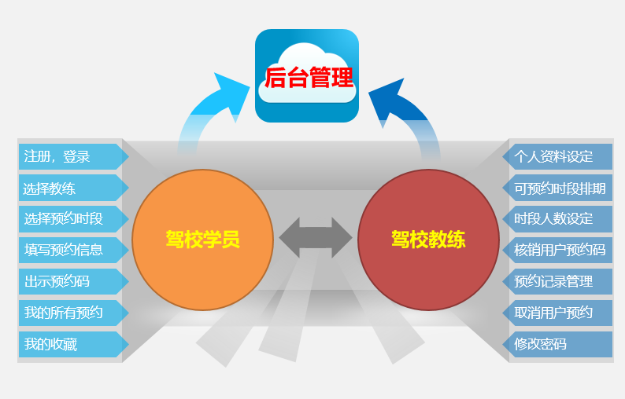

## 功能介绍 
 
随着机动车逐渐走进寻常百姓家中,学车也随之被人们提上了日程,这使得汽车驾驶培训行业得到迅猛发展。移动互联网技术的广泛应用,使手机约车成为可能,如何合理地分配已有资源,提高资源利用率,增强驾校服务水平,己成为驾校越来越迫切的需求。驾校学车预约小程序使预约者只需拿起手机,就可以线上约车,可以做到“足不出户选教练”,这样能够有效减少学习者的等待时间,从而为学员提供更优质的服务。
本系统包含学员端，教练端，管理端三方，不前后端完整，包括公告，驾校教练预约，科目培训预约，后台管理，用户管理，预约名单管理，预约记录管理与导出，我的预约，历史浏览，我的收藏等模块，采用腾讯提供的小程序云开发解决方案，无须服务器和域名。

本项目分为学员端，驾校教练端，后台端3个组成部分：
- 后台端：可以添加和设定教练的基本信息，账号，登陆密码等。
- 驾校教练端：可以编辑自己的个人资料（头像，简介，星级等），设定预约时段排期（可预约时段，各时段人数限定）， 在现场核销用户的预约码。
- 学员端：选择自己需要的教练和时段，下单预约，预约成功后到健身房出示预约码给教练或者工作人员核销

.jpg)

- 预约管理：开始/截止时间/人数均可灵活设置，可以自定义客户预约填写的数据项
- 预约凭证：支持线下到场后校验签到/核销/二维码自助签到等多种方式
- 详尽的预约数据：支持预约名单数据导出Excel，打印

## 技术运用
- 本项目使用微信小程序平台进行开发。
- 使用腾讯专门的小程序云开发技术，云资源包含云函数，数据库，带宽，存储空间，定时器等，资源配额价格低廉，无需域名和服务器即可搭建。
- 小程序本身的即用即走，适合小工具的使用场景，也适合快速开发迭代。
- 云开发技术采用腾讯内部链路，没有被黑客攻击的风险，不会 DDOS攻击，节省防火墙费用，安全性高且免维护。
- 资源承载力可根据业务发展需要随时弹性扩展。  

## 作者
- 如有疑问，欢迎骚扰联系我：开发交流，技术分享，问题答疑，功能建议收集，版本更新通知，安装部署协助，小程序开发定制等。
- 俺的微信: 

 

## 演示 
 

## 安装

- 安装手册见源码包里的word文档

## 学员端截图
 

## 教练端截图

## 后台管理系统截图 
- 后台超级管理员默认账号:admin，密码123456，请登录后台后及时修改密码和创建普通管理员。

